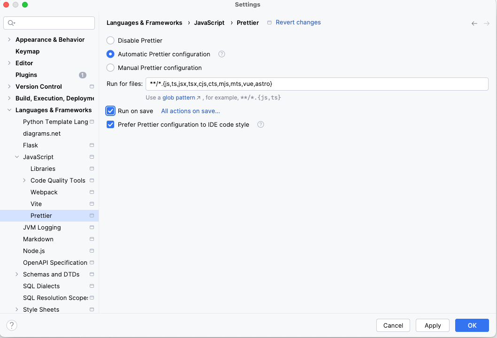

# HOW TO LINT CODEBASE

## Format with prettier

- Remove eslint config from package.json if existing
First, remove all existing elsint configuration because for example eslint can be added when installing React via some dependencies
Plus, it is better to keep configuration away from package.json and put it in a specific configuration file.

- Install prettier in dev dependencies
In a react project, it is possible to install all dependencies as dev dependencies cause it will be build for production so it doesn't make much sense to separate dependencies by env.


```shell
npm i -D prettier
```

- Ignore some files. Cause you don't need to lint all files in the project

```shell
touch .prettierignore
```
Add this to the file
```txt
node_modules
# Ignore artifacts:
build
coverage
```

- Add config file
```shell
touch .prettierrc.json
```

```json
{
  "trailingComma": "es5",
  "tabWidth": 4,
  "semi": true,
  "singleQuote": false
}
```

- Add script in package.json
To check if some file had a bad formmating for example.
```json
{
  "lint": "prettier --check ."
}
```

It means you now have to format all files `npx prettier --write .`
We can add a command in `package.json` to enhance use, or automatically format by configurate IDE to fo rmatautomatically on save or go further by lint staged files with a pre-commit hook.


## Config IDE

- Config your IDE to apply prettier automatically on saving files
  

- Adding .editorconfig to fix some rules

```shell
touch ..editorconfig
```

- With text
```text
root = true

[*]
charset = utf-8
end_of_line = lf
```

# Eslint
- Adding eslint configuration can prevent bugs and fix errors like unused variables or packages imported but not used.
- One exemple with prettier and typescript can be seen on this [node repo](https://github.com/annemarie35/js-training/commit/625b23583e968280e4897e8c60bada3f1c744428)


## Go further, add a github action to forbid merge if files are not well formatted

Add a github action via  adding this file in project root `.github/workflows/frontend-test.yml`

```yml
name: Test Frontend

on:
  pull_request:

jobs:
  test:

    runs-on: ubuntu-latest
    env:
      WORKING_DIRECTORY: ./frontend/my-project

    steps:
      - uses: actions/checkout@v3
      - name: Install Node
        uses: actions/setup-node@v3
        with:
          node-version: 18
          cache: 'npm'
          cache-dependency-path: '${{ env.WORKING_DIRECTORY }}/package-lock.json'
      - name: Install Application
        run: npm ci
        working-directory: ${{ env.WORKING_DIRECTORY }}
      - name: Lint
        run: npm run lint
        working-directory: ${{ env.WORKING_DIRECTORY }}
      - name: Build
        run: npm run build
        working-directory: ${{ env.WORKING_DIRECTORY }}
```


# Adding lint-staged package


[Source](https://delicious-insights.com/fr/articles-et-tutos/git-hooks-et-lint-staged/)