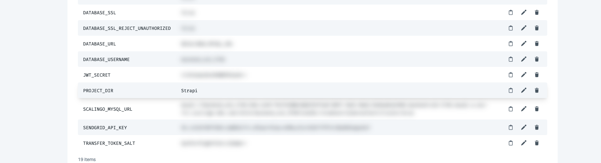
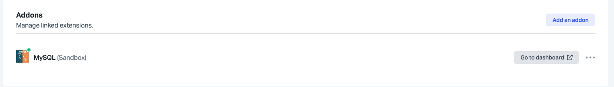
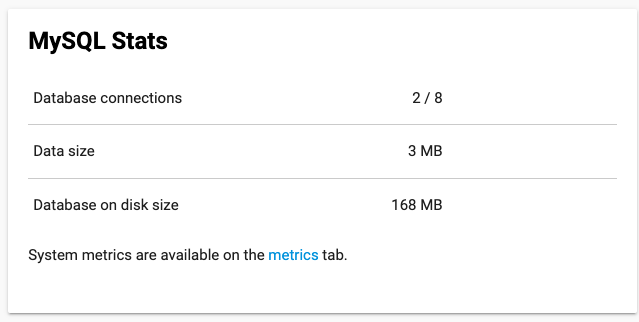

# DEPLOY ON SCALINGO

Se créer un compte sur Scalingo
> Il est possible d'inviter des personnes au projet et de déléguer la propriété à un autre utilisateur également

## (Optionnel, les applications sont déjà créés et accessibles)
- Créer une nouvelle application **frontend-eiko-challeng**e pour le front
- Créer une nouvelle application **backend-eiko-challenge** pour le back
> Il est possible de modifier ces nom ultérieurement

- Ajouter un **addon**, par exemple une base de données **Mysql** pour l'application **backend-eiko-challenge**
Dans l'onglet ressources sur Scalingo [https://dashboard.scalingo.com/apps/osc-fr1/backend-eiko-challenge/resources](https://dashboard.scalingo.com/apps/osc-fr1/backend-eiko-challenge/resources), cliquer sur `Add an addon`

## Installer la cli Scalingo sur sa machine

Télécharger et installer la CLI, [documentation](https://doc.scalingo.com/platform/cli/start)
```shell
curl -O https://cli-dl.scalingo.com/install && bash install
```
Ajouter sa clé SSH dans https://dashboard.scalingo.com/account/keys après l'avoir copié depuis sa machine avec, par exemple, la commande : 

``` shell
cat ~/.ssh/id_ma-cle-ssh.pub
```
Se logger à la CLI de scalingo 

```shell
scalingo login
```

Vous pouvez désormais vous connecter à Scalingo via la CLI.

## Choisir le mode de déployement manuel

Scalingo propose plusieurs façons de déployer (Menu **Deploy** puis **Configuration**) :
- via Git
- via Github, en donnant accès au repo à déployer
- Gitlab,en donnant accès au repo à déployer

Utilisant framagit sur le projet, nous ne pouvons qu'utiliser la première option.
Vous pouvez ajouter localement le lien vers le repo Scalingo vers où pusher le code de l'application.
Pour plus de détails sur ce fonctionnement voir la [documentation de Scalingo](https://doc.scalingo.com/platform/deployment/deploy-with-git).

```shell 
git remote add backend-scalingo git@ssh.osc-fr1.scalingo.com:backend-eiko-challenge.git
git remote add frontend-scalingo git@ssh.osc-fr1.scalingo.com:frontend-eiko-challenge.git
```
On vérifie qu'on voit bien les remote :

```shell
git remote -v
```

## Ajouter les variables d'environnement

Se rendre dans le menu **Environnement**.


Comme nous sommes dans un monorepo, on va pusher sur le repo scalingo l'ensemble du code back et front.
Il faut spécifier quel dossier doit être utilisé pour l'application choisie afin que lors du déployement, Scalingo sache dans quel dossier se mettre et lancer l(a)es commande(s) nécessaire(s) au lancement de l'application et spécifié dans le fichier `.Procile`

- `PROJECT_DIR:Strapi` pour l'application **backend-eiko-challenge**
- `PROJECT_DIR:NextJs` pour **frontend-eiko-challenge**



## Déployer

Vous êtes en local.
Il n'existe qu'une branche main sur Scalingo par défaut, pour pousser le contenu de la branche `30-dashboard-repartition-par-type` utiliser la commande suivante :

```shell
git push frontend-scalingo 32-poc-deploiement-sur-scalingo:main
```

Sinon pour déployer la version de **main** :

```shell
git push frontend-scalingo main
```

## Se connecter à la bdd 

```shell
scalingo --region osc-fr1 --app backend-eiko-challenge mysql-console
```

## Erreurs rencontrées au déploiement

### `ER_CON_COUNT_ERROR: Too many connections`

Aller dans le dashboard de la base de données



Database connections



Alors modifier les variables d'environnements **backend-eiko-challenge** en spécifiant :

```shell
DATABASE_POOL_MAX=8
DATABASE_POOL_MIN=2
```

Sources :
[Official Scalingo Documentation](https://github.com/Scalingo/documentation)
[https://github.com/GradedJestRisk/hello-scalingo](https://github.com/GradedJestRisk/hello-scalingo)

### Bug sur la version 8 de mysql 
Nous pouvons voir que la base mysql est dans une ancienne version, qui plus est n'est plus maintenue :
> Your database can be upgraded from 5.7.42-1 to 8.0.35-1

Cependant, nous n'avons pas pu déployer l'application avec cette version, à cause de l'erreur `ER_OUT_OF_SORTMEMORY`
```shell
2023-12-20 09:08:33.710630664 +0000 UTC [web-1] [2023-12-20 09:08:33.708] debug: ⛔️ Server wasn't able to start properly.
2023-12-20 09:08:33.711082945 +0000 UTC [web-1] [2023-12-20 09:08:33.710] error: select * from `strapi_database_schema` order by `time` DESC limit 1 - ER_OUT_OF_SORTMEMORY: Out of sort memory, consider increasing server sort buffer size
2023-12-20 09:08:33.711096662 +0000 UTC [web-1] Error: ER_OUT_OF_SORTMEMORY: Out of sort memory, consider increasing server sort buffer size
```
Nous ne pouvons pas modifier le serveur mysql et modifié la valeur de `sort_buffer_size` comme suggéré sur certains réponses suggérées pour résoudre ce problème.
[L'erreur serait un bug sur la version 8](https://www.digitalocean.com/community/questions/out-of-sort-memory-consider-increasing-server-sort-buffer-size-error-on-mysql-managed-db)

> L'application a pu être déployée avec mysql 5.7.42-1

## Commandes utiles

Récupérer les logs d'une application en local

```shell
scalingo --region osc-fr1 --app frontend-eiko-challenge logs --lines 100000
```

Se connecter à la base de données 

```shell
scalingo --region osc-fr1 --app backend-eiko-challenge mysql-console
```

Démarrer un container en one-off
```shell
scalingo --region osc-fr1 --app backend-eiko-challenge run bash
```