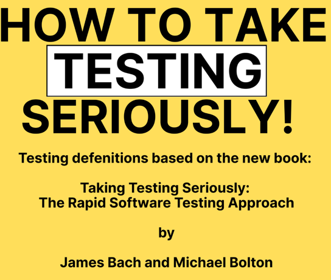

# LET's TALK ABOUT TESTS BABY

## Jeux de données
Des idées de jeux de noms avec nom et prénom pour agrémenter vos tests et jeux de données [ici](https://web.archive.org/web/20220127001828/https://mescanefeux.com/452)
Pour ma part, **Saml Jackson** sur de l'authentification via Oauth, ça m'a fait mon année.

## Rapid Software Testing (RST) 
[Alexander Carlson](https://www.linkedin.com/feed/update/urn:li:activity:7388995842625507328/) is launching a new series on Rapid Software Testing (RST) terminology, inspired by James Bach and Michael Boltons highly anticipated 500+ page book:

## Alan Perlis
(first recipient of the ACM Turing Award for computing):
> “A software system can best be designed if the testing is interlaced with the designing instead of being used after the design.”