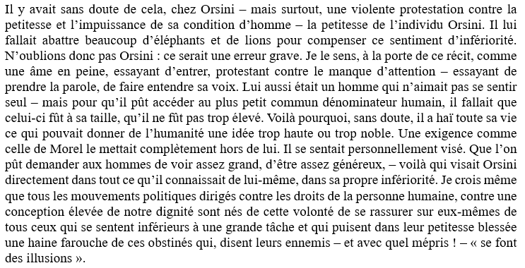

> "Toute sa vie n’a été qu’une longue protestation contre son peu d’importance : c’était cela, sans doute, qui l’avait poussé à tuer tant de bêtes magnifiques"

— Gary, Romain. Les racines du ciel. Paris : Gallimard, 1956.

> L’injonction à l’héroïsme de l’Ur-fascime qu’Umberto Eco relève : « Si dans toute mythologie, le héros est un être exceptionnel, dans l’idéologie Ur-fasciste, le héros est la norme » (Eco, 1997).
> « Puisque la guerre permanente et l’héroïsme sont des jeux difficiles à jouer, l’Ur-fasciste transfère sa volonté de puissance sur des questions sexuelles. Là est l’origine du machisme (impliquant le mépris pour les femmes et la condamnation intolérante de mœurs sexuelles non conformistes, de la chasteté à l’homosexualité). » (Eco, 1997).

— Eco, Umberto. Reconnaître le fascisme. Paris : Grasset, 1997.
 [source](https://lanewsletterbie.wordpress.com/2024/06/25/no-10-ce-que-nos-echecs-nous-font-sentir/)