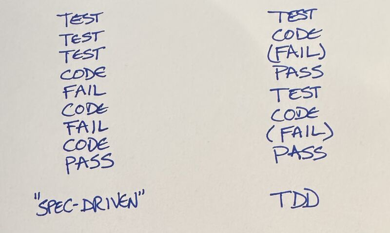

# PEOPLE'S QUOTE FROM SOCIALS

> The descriptions of Spec-Driven development that I have seen emphasize writing the whole specification before implementation. This encodes the (to me bizarre) assumption that you aren't going to learn anything during implementation that would change the specification.
I've heard this story so many times told so many ways by well-meaning folks--if only we could get the specification "right", the rest of this would be easy.

— Kent Beck en janv 2026 [linkedin](https://www.linkedin.com/posts/kentbeck_the-descriptions-of-spec-driven-development-activity-7413956151144542208-EGMz)

> yt's truly amazing what LLMs can achieve. we now know it's possible to produce an html5 parsing library with nothing but the full source code of an existing html5 parsing library, all the source code of all other open source libraries ever, a meticulously maintained and extremely comprehensive test suite written by somebody else, 5 different models, a megawatt-hour of energy, a swimming pool full of water, and a month of spare time of an extremely senior engineer

- Glyph @glyph@mastodon.social en décembre 2025 [source](https://mastodon.social/@glyph/115732687795909357)
